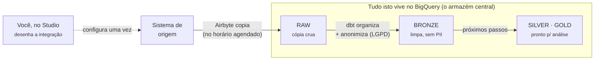
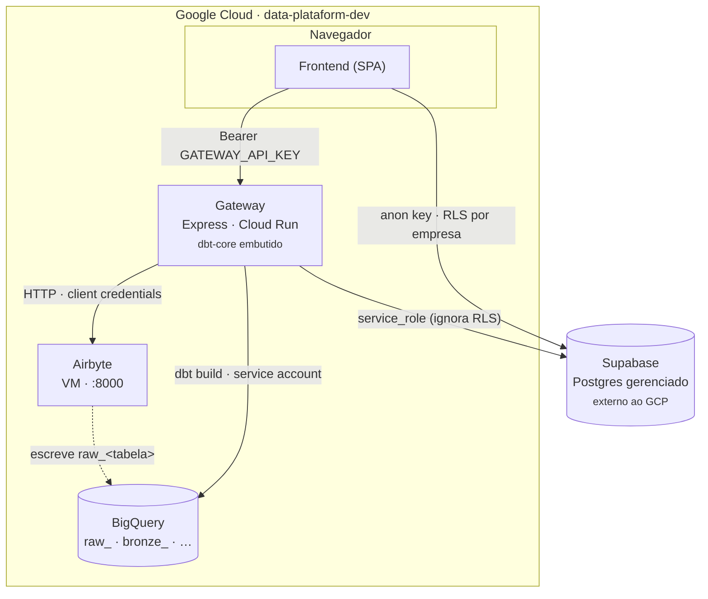

# Arquitetura da DataCore

> Documento de arquitetura. Começa em linguagem simples, para qualquer pessoa,
> e depois entra no detalhe técnico de componentes, fluxos e da camada Bronze em dbt.

A DataCore é uma **plataforma visual para montar pipelines de dados**: a pessoa
usuária desenha, no navegador, de onde os dados vêm e para onde vão — e a
plataforma copia, organiza e anonimiza (LGPD) essas tabelas dentro de um data
lakehouse no BigQuery.

- **Camadas:** RAW → Bronze → Silver → Gold (padrão *medalhão*)
- **Stack:** React · Node/Express · Airbyte · dbt · BigQuery · Supabase (Postgres)
- **Multi-tenant:** isolamento por empresa (`id_empresa`) com Row-Level Security

---

## Sumário

1. [Em linguagem simples](#1-em-linguagem-simples)
2. [As quatro camadas](#2-as-quatro-camadas)
3. [Os componentes](#3-os-componentes)
4. [Arquitetura técnica](#4-arquitetura-técnica)
5. [Quem fala com quem](#5-quem-fala-com-quem)
6. [Fluxo: criar uma integração](#6-fluxo-criar-uma-integração)
7. [Fluxo: RAW → Bronze com dbt](#7-fluxo-raw--bronze-com-dbt)
8. [A camada Bronze em detalhe](#8-a-camada-bronze-em-detalhe)
9. [Deploy e operação](#9-deploy-e-operação)
10. [Decisões e lacunas conhecidas](#10-decisões-e-lacunas-conhecidas)
11. [Política de falha da Raw](#11-política-de-falha-da-raw)

---

## 1. Em linguagem simples

> Para qualquer pessoa.

Imagine que os dados de um sistema (um banco de vendas, um CRM, uma planilha)
estão numa gaveta bagunçada. A DataCore faz três coisas com eles:

1. **Copia** as tabelas escolhidas para um armazém central (o BigQuery), sem
   alterar o sistema de origem.
2. **Organiza e limpa** essa cópia: padroniza nomes, remove duplicatas e
   **anonimiza dados pessoais** (CPF, e-mail, cartão) para atender à LGPD.
3. **Deixa pronto** para análise, em camadas: cada camada é uma versão mais
   tratada da anterior.

Quem usa a plataforma monta tudo isso num assistente de **três passos** —
Origem, Destino, Tabelas — sem escrever código. A partir daí a cópia acontece no
horário agendado e a organização é feita automaticamente.



*A jornada de um dado: da gaveta bagunçada da origem até uma versão limpa e sem
dados pessoais, pronta para relatórios.*

---

## 2. As quatro camadas

> Para qualquer pessoa.

A organização segue o padrão **"medalhão"**, comum em data lakehouses. Cada
camada é um dataset no BigQuery e uma versão progressivamente mais confiável dos
dados.

| Camada | O que é |
| --- | --- |
| **RAW** | **Cópia fiel** do que veio da origem, sem transformação. Escrita pelo Airbyte. Tabelas com prefixo `raw_`. |
| **BRONZE** | **Higienizada.** Colunas renomeadas, marca d'água de ingestão (`_dat_carga`), carga incremental por chave e **anonimização LGPD** (Art. 46). É a camada que a DataCore gera automaticamente, com dbt. |
| **SILVER** | **Curada.** Regras de negócio, junções, dimensões conformadas. Hoje existe apenas como exemplo — ainda sem geração automática. |
| **GOLD** | **Pronta para consumo.** Métricas e KPIs agregados para dashboards. Também apenas exemplo por enquanto. |

---

## 3. Os componentes

> Ponte para o técnico.

Seis peças, cada uma com um papel claro. Frontend e Gateway são código da
DataCore; o resto são serviços que a DataCore orquestra.

| Peça | Tecnologia | Onde roda | Responsabilidade |
| --- | --- | --- | --- |
| **Frontend** | React + Vite (SPA) | Cloud Run (estático) | Studio visual: assistente de integração, canvas do pipeline, monitoramento, governança. |
| **Gateway** | Node + Express (TypeScript), `server/` | Cloud Run | Único backend. Proxy do Airbyte, escrita no Supabase e orquestração da camada Bronze via dbt. |
| **Banco da aplicação** | Supabase (Postgres gerenciado) | Supabase Cloud | Empresas, usuários, origens, destinos, integrações, pipelines, histórico de execuções. RLS por `id_empresa`. |
| **Conectores** | Airbyte (OSS, via `abctl`) | VM no GCP · porta 8000 | Extrai dados das origens (Postgres, MySQL, Faker, Google Sheets) e escreve na camada RAW do BigQuery. |
| **Data lakehouse** | Google BigQuery | GCP | Armazena todas as camadas: `raw_*`, `bronze_*` e (futuro) silver/gold. |
| **Transformação** | dbt-core + `dbt-bigquery` | Dentro da imagem do Gateway | Constrói a camada Bronze. Modelos `.sql` gerados por integração e versionados no repositório. |

### Linguagens por área

| Linguagem | Onde é usada |
| --- | --- |
| **TypeScript (.ts)** | Backend/gateway (`server/`) — rotas Express, integração com Airbyte/BigQuery/GCP, agente de IA; e lógica/utilitários do frontend (`src/lib/`, `src/data/`) fora dos componentes visuais |
| **TypeScript + JSX (.tsx)** | Toda a interface React do console (`src/components/**`) — Studio Visual ETL, Studio Gold, Pipelines, Execuções, Custos & FinOps, Governança, Segurança, Empresas etc. |
| **SQL** | Dois contextos: modelos dbt (`dbt/models/**`, a maioria — camadas Bronze/Silver/Gold no BigQuery) e migrações do banco (`sql/*.sql`, schema/RLS do Supabase/Postgres) |
| **YAML** | Configuração do dbt (`dbt_project.yml`, `profiles.yml`, `packages.yml`), documentação de schema dos modelos (`_properties.yml`, `_sources.yml`) e configs de deploy (`cloudbuild.frontend.yaml`, `cloudbuild.gateway.yaml`) |
| **JSON** | Configuração de projeto (`package.json`, `tsconfig.json`) e manifests gerados pelo dbt (`dbt/_generated_bronze.json` etc., usados pelo editor SQL do Studio) |
| **HTML** | `index.html` — ponto de entrada da SPA (Vite) |
| **CSS** | `src/index.css` — estilos globais (Tailwind) |
| **Dockerfile** | `Dockerfile` / `Dockerfile.frontend` — build dos containers do gateway e do frontend |
| **CSV** | `dbt/seeds/raw_transacoes.csv` — dado semente (seed) do dbt |

SQL e TypeScript/TSX dominam o repositório (93 e 87 arquivos, respectivamente,
contra 18 YAML e 8 JSON) — reflexo de ser uma plataforma de dados (transformação
em dbt) com um console web em React/Node por cima.

---

## 4. Arquitetura técnica

> Detalhe técnico.

O **Gateway é o centro**: o Frontend nunca fala diretamente com Airbyte,
BigQuery ou dbt. Ele autentica no Gateway com uma chave de aplicação
(`GATEWAY_API_KEY`) enviada como `Bearer` — **não** um token de sessão do
Supabase, porque o login da DataCore não cria uma sessão do Supabase Auth (faz
verificação de senha bcrypt contra a tabela `usuarios`).



*Setas contínuas = chamadas de controle. Seta tracejada = movimento de dados. O
Gateway é a única peça que toca Airbyte, BigQuery e dbt; o Frontend só fala com
o Gateway e (para leitura via RLS) com o Supabase.*

### Multi-tenant

Cada **empresa** é um tenant. O isolamento no banco é por **Row-Level Security**
em `id_empresa` — o Frontend usa a *anon key* e só enxerga as linhas da própria
empresa; o Gateway usa a *service role key* e é responsável por escopar cada
escrita manualmente. Hoje todos os tenants compartilham o mesmo projeto GCP, o
mesmo workspace do Airbyte e a mesma service account do BigQuery.

---

## 5. Quem fala com quem

> Detalhe técnico.

| De | Para | Protocolo | Autenticação | Para quê |
| --- | --- | --- | --- | --- |
| Navegador | Frontend | HTTPS | — | Baixar a SPA (arquivos estáticos) |
| Frontend | Gateway | HTTPS / JSON | `Bearer GATEWAY_API_KEY` | Toda operação de backend |
| Frontend | Supabase | HTTPS (PostgREST) | anon key + RLS | Ler/gravar dados da própria empresa |
| Gateway | Supabase | HTTPS | service role key | Escritas que precisam ignorar RLS (ex.: criar conta, gravar integração) |
| Gateway | Airbyte | HTTP · `:8000` | client id/secret → token | Criar/rodar sources, destinos e conexões |
| Gateway | BigQuery | HTTPS (API) | service account JSON | Rodar `dbt build`, criar datasets e tabelas Bronze |
| Airbyte | BigQuery | HTTPS | service account (do destino) | Escrever as tabelas `raw_*` |

> **Rede.** A VM do Airbyte usa o IP estático `34.39.199.115` (reservado em
> 2026-09-15 como `datacore-airbyte-vm-ip`, região `southamerica-east1` — antes
> era efêmero e mudava a cada stop/start, quebrando `AIRBYTE_BASE_URL`). A
> porta 8000 precisa de regra de firewall para o Cloud Run.

---

## 6. Fluxo: criar uma integração

> Detalhe técnico.

O assistente tem três passos. Ao concluir, seis tipos de artefato são criados de
uma vez:

| Passo | O que a pessoa usuária faz | O que é criado |
| --- | --- | --- |
| **1 · Origem** | Escolhe/cadastra o conector de origem | *Source* no Airbyte |
| **2 · Destino** | Aponta o dataset BigQuery (prefixo `raw_`) | *Destination* BigQuery no Airbyte |
| **3 · Tabelas & agenda** | Seleciona tabelas, modo de carga e frequência | • *Connection* no Airbyte (com `prefix: raw_`)<br/>• Linhas em `integracoes` e `pipelines` (Supabase)<br/>• Modelos dbt Bronze — um `.sql` por tabela — em `models/medallion/bronze/<sistema>/`<br/>• A *source* dbt compartilhada é atualizada com as novas tabelas |

- As tabelas do Passo 3 vêm **exclusivamente da descoberta real do Airbyte** —
  sem lista de exemplo. Se os Passos 1 e 2 não foram concluídos, o Passo 3 não
  mostra tabelas.
- A geração dos modelos dbt tem **3 tentativas** no caminho direto e um
  *fallback* que reconstrói o spec a partir do estado persistido
  (`POST /api/dbt/models/from-integration`) — este é também o gancho que a
  orquestração (Airflow) vai chamar no futuro.

---

## 7. Fluxo: RAW → Bronze com dbt

> Detalhe técnico.

Depois que o Airbyte sincroniza (a tabela `raw_<t>` passa a existir), a Bronze é
construída pelo dbt — disparada pelo botão "Construir Camada Bronze" no Studio,
ou pelo gatilho automático.

```mermaid
sequenceDiagram
    participant AB as Airbyte
    participant ST as Studio
    participant GW as Gateway
    participant DBT as dbt (na imagem do Gateway)
    participant BQ as BigQuery

    AB->>BQ: grava raw_&lt;t&gt;
    ST->>GW: POST /api/bigquery/bronze/build
    Note over GW: contexto por requisição<br/>DBT_RAW_DATASET · DBT_SCHEMA_BRONZE
    GW->>DBT: dbt build --select bronze_&lt;sistema&gt;_&lt;t&gt;
    Note over DBT: 1 · lê source('datacore_raw', t)<br/>2 · renomeia + _dat_carga<br/>3 · LGPD Art. 46: mascara CPF, tokeniza e-mail, hash cartão/senha<br/>4 · só registros novos (_dat_carga &gt; max_dat_carga)<br/>5 · incremental merge (se PK)
    DBT->>BQ: &lt;dataset&gt;.bronze_&lt;sistema&gt;_&lt;t&gt;
```

*O Gateway passa o dataset de origem e o de destino por variável de ambiente a
cada chamada; o mesmo modelo serve qualquer integração daquele sistema.*

---

## 8. A camada Bronze em detalhe

> Detalhe técnico.

### Organização dos arquivos

Os modelos são **versionados no repositório** e organizados por camada e por
**sistema de origem** — o slug do "Nome da origem" da integração
(ex.: *DataCore* → `datacore`).

```
dbt/models/medallion/bronze/
├── _properties.yml            # exemplo (bronze_transacoes)
├── bronze_transacoes.sql      # exemplo, ligado só com DBT_DEMO_ENABLED
└── <sistema>/                 # uma pasta por sistema de origem
    ├── _properties.yml        # todos os modelos do sistema: descrição + testes
    └── bronze_<sistema>_<tabela>.sql
```

O nome do modelo carrega o sistema (`bronze_datacore_usuarios`) porque o dbt tem
**namespace global de modelos** e sistemas diferentes costumam ter tabelas de
mesmo nome. O `alias` mantém esse nome na tabela do BigQuery. Dois manifestos
JSON (`dbt/_generated_sources.json`, `dbt/_generated_bronze.json`) acumulam o
estado por *merge* — criar a integração B não apaga os modelos da A.

### O que cada modelo faz

- **Tipagem leve & renome** das colunas selecionadas na integração, seguindo a
  [convenção de nomenclatura da Bronze](./CONVENCAO_NOMENCLATURA_BRONZE.md)
  (prefixo por tipo — `des_`, `vlr_`, `ind_`, `dat_`, `dth_`, `cod_`, `id_`,
  etc. — implementado em `server/bronzeNaming.ts`).
- **Marca d'água:** `_dat_carga` (de `_airbyte_extracted_at` — data da carga
  pelo Airbyte) e `_dbt_loaded_at`. Modelos incrementais buscam no início a
  maior `_dat_carga` já gravada (macro `max_dat_carga()`) e leem da Raw só o
  que chegou depois dela.
- **LGPD Art. 46** por heurística de nome de coluna — `dbt/macros/lgpd.sql`:
  `cpf|cnpj` → redação parcial; `email` → tokenização preservando o domínio;
  `cartao|telefone|rg|senha` → hash SHA-256.
- **Sem deduplicação no modelo:** no incremental, a Raw é filtrada pelos
  registros com `_dat_carga` posterior à maior já gravada e o `merge` usa a
  chave primária (`unique_key`) para atualizar/inserir só esses registros.
- **Materialização:** `incremental` com estratégia `merge` quando a carga é
  incremental e há PK; caso contrário, `table`.

> **Sem fallback fora do dbt.** O antigo
> `CREATE OR REPLACE TABLE … AS SELECT *` foi removido. Se um modelo não existe
> para a tabela pedida, a construção falha com erro claro — não há cópia crua
> silenciosa.

---

## 9. Deploy e operação

> Detalhe técnico.

- **Frontend** e **Gateway**: imagens Docker via Cloud Build
  (`cloudbuild.frontend.yaml`, `cloudbuild.gateway.yaml`) → Cloud Run. As
  variáveis `VITE_*` são embutidas no bundle do Frontend em *build time*.
- **Segredos** (service role, client secret do Airbyte, `GATEWAY_API_KEY`, JSON
  da service account BigQuery): Secret Manager, montados como `--set-secrets`.
- A imagem do Gateway instala `python3` + `dbt-bigquery` e **"assa" a pasta
  `dbt/`**. Consequência: um modelo novo/alterado só constrói via dbt **depois
  de um redeploy** (ou de um `git pull` do `dbt/` no start — ainda não
  implementado; ver `DBT_CODEGEN_GIT`).
- **Concorrência:** as execuções de dbt são serializadas no processo;
  recomenda-se `--max-instances=1` no serviço do Gateway.
- **Cron:** o gatilho automático da Bronze
  (`/api/bigquery/bronze/auto-sync`) não roda sozinho — Cloud Run escala a
  zero. Será orquestrado por **Airflow** (decisão de projeto); o Cloud Scheduler
  foi deliberadamente não criado.

O runbook completo de deploy está em [`../DEPLOY.md`](../DEPLOY.md); o detalhe do
projeto dbt, em [`../dbt/README.md`](../dbt/README.md).

---

## 10. Decisões e lacunas conhecidas

> Detalhe técnico.

- **Modelos versionados no repo** (não em bucket) — simples de revisar, mas
  acopla a construção da Bronze ao ciclo de deploy da imagem.
- **Silver** é gerada como passthrough da Bronze (`silver/<sistema>/`), incremental
  pela mesma chave quando a Bronze é incremental (lê da Bronze só `_dat_carga`
  posterior à maior já gravada na Silver). **Gold** não tem codegen.
- **Tipos de coluna** não são propagados do *discovery* do Airbyte — a Bronze
  faz renome, não cast estrito.
- **Excluir integração** no "Pipelines & Fluxos" apaga do banco (a integração, o
  pipeline e o histórico caem por `ON DELETE CASCADE`). **Não** remove a
  conexão no Airbyte nem os `.sql` gerados.
- **Auth:** o login não cria sessão do Supabase Auth — qualquer novo backend
  deve usar a chave de aplicação, não um JWT de sessão.
- Falha de *teste* dbt marca a resposta como não-ok (HTTP 207) mas não vira erro
  por tabela — o `bronze_status` do histórico segue como `built`.

---

## 11. Política de falha da Raw

> O que acontece quando a sincronização da Raw (Airbyte) falha — por mudança de
> schema na origem ou qualquer outro erro. Código: `server/rawFailurePolicy.ts`;
> banco: `sql/015_raw_failure_policy.sql`.

**Mudança de schema na origem** (`nonBreakingSchemaUpdatesBehavior = propagate_columns`,
aplicado em toda conexão nova e, nas existentes, por
`POST /api/airbyte/connections/schema-policy`):

| Mudança | O que acontece na Raw | E na Bronze/Silver |
|---|---|---|
| Coluna nova | Propagada automaticamente, sync segue | Nada muda — a Bronze lista as colunas; para incluí-la, regenerar os modelos dbt da integração |
| Coluna removida | Propagada; a coluna fica nula na Raw | Continua construindo (valor nulo) |
| Tipo de coluna alterado | Propagado | O `dbt build` pode falhar na tabela → erro por tabela; reconstruir com "Do zero" |
| Chave primária ou cursor alterado/removido (**incompatível**) | O Airbyte **bloqueia a conexão** (não há como evitar) | Não é construída — alerta "Schema incompatível" |

**Mudança que pode quebrar as camadas seguintes = atualização bloqueada**
(`sql/017`, `server/schemaChangeCheck.ts`): o schema da origem é comparado com a
última "foto" (`integracoes.schema_snapshot`) a cada "Executar" com sync e pelo
botão "Verificar schema agora" (alertas da integração em Pipelines & Fluxos).
Tipo de coluna alterado, coluna removida, chave primária alterada e tabela
integrada removida geram alerta **bloqueante**: enquanto ele estiver aberto, a
Bronze, a Silver e o Gold daquela tabela **não são atualizados** (continuam com a
última carga boa; as demais tabelas seguem normalmente). O alerta diz isso
explicitamente; marcá-lo como ciente/resolvido libera a atualização na próxima
execução. Coluna nova e tabela nova só geram alerta informativo.

**Qualquer sync que falhe** (schema, credencial, origem fora do ar, BigQuery, rede):

1. **Motivo real:** o gateway lê a falha do job na API interna do Airbyte
   (`GET /api/airbyte/connections/:id/jobs/:jobId/diagnosis`), classifica
   (`schema_incompativel`, `configuracao`, `origem`, `destino`, `transitorio`,
   `plataforma`, `desconhecido`) e monta a ação recomendada.
2. **Registro:** o motivo vai para `pipeline_runs.raw_erro`/`raw_erro_categoria`
   e para o item Raw da execução na tela Execuções.
3. **Alerta:** uma linha em `alertas_ingestao` (uma por job), exibida para toda a
   empresa no topo da tela Execuções até alguém clicar em "Resolvido". Ainda não
   há e-mail/Slack (sem SMTP/domínio).
4. **Último dado bom:** Bronze e Silver da integração **não** são construídas —
   continuam com os dados da última carga que deu certo. O Gold que depende delas
   também é pulado.
5. **Nova tentativa:** o próprio Airbyte já repete as tentativas dentro do job;
   o DataCore não repete sozinho. Depois de corrigir a causa, basta "Executar" de novo.

